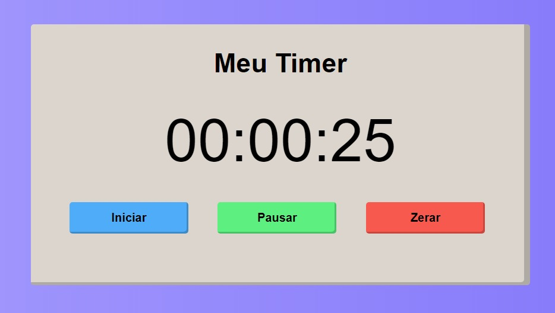

## :clock2: Timer-Javascript

## :pushpin:Sobre

Cronômetro criado com Javascript, com as opções de pausar e zerar a contagem.



## :closed_book:Tecnologias

* HTML
* CSS
* Javscript
## :pencil:Instalação

Clonar o repositório abaixo:
```
$ git clone git@github.com:jotapgn/Timer-Javascript.git
```
## :pencil:Como Executar
```
Execute o arquivo index.html com o navegador de sua preferência
